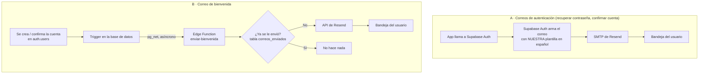

# Correos propios en Kheep: recuperación de contraseña y bienvenida

Este documento explica cómo funcionaría el envío de correos con un proveedor propio y qué hay que crear en el panel, en el código y en la base de datos.

> **Estado (19/09/2026):** la recuperación de contraseña con código (sección 5) **ya está implementada** en la app. Solo falta cambiar la plantilla del correo en Supabase para que muestre el código. El proveedor propio y el correo de bienvenida siguen pendientes.

---

## 1. Por qué hace falta

Hoy todos los correos salen del servidor compartido de Supabase. Sirve para probar, pero no para producción:

| Problema | Consecuencia |
|---|---|
| Máximo **2 correos por hora** para todo el proyecto | Con 3 personas pidiendo recuperar su contraseña en la misma hora, la tercera no recibe nada. Es el error `email rate limit exceeded` que salió en las pruebas de registro. |
| Remitente genérico (`noreply@mail.app.supabase.io`) | Parece spam y muchas veces termina en esa carpeta. |
| Plantillas en inglés y sin marca | No se ven como correos de Kheep. |
| No existe correo de bienvenida | Supabase solo manda correos de autenticación. La bienvenida hay que construirla aparte. |

## 2. ¿Gmail o Resend?

Lo que conversamos en su momento fue **Resend**. Gmail también se puede usar, porque Supabase acepta cualquier servidor SMTP. Esta es la comparación:

| | **Resend** (recomendado) | Gmail |
|---|---|---|
| Remitente | `no-responder@kheep.cl` (dominio propio) | `algo@gmail.com` |
| Límite gratis | 3.000/mes, 100/día | ~500/día |
| Pensado para que una app envíe correos | Sí | No: Google puede bloquear la cuenta si detecta envíos automáticos |
| Requisitos | Dominio propio y registros DNS | Verificación en 2 pasos + "contraseña de aplicación" |
| Llega a la bandeja de entrada | Muy bien, con el dominio verificado | Regular |
| Correo de bienvenida desde el servidor | API HTTP simple | Solo SMTP, más engorroso |

**Recomendación: Resend.** Si todavía no hay dominio, Gmail sirve como puente temporal. Pasar de uno a otro después es cambiar 4 datos en el panel de Supabase; la app no se toca.

> Revisa los límites en la página de precios de Resend antes de crear la cuenta. Los proveedores los cambian de vez en cuando.

> **Importante:** sin un dominio verificado, Resend solo entrega correos a la dirección de quien creó la cuenta. Sirve para probar, pero los usuarios reales no los recibirían. **Comprar el dominio es lo que destraba todo lo demás.**

---

## 3. Cómo funcionaría

Hay dos caminos distintos, porque son correos de naturaleza distinta:



**Camino A:** Supabase sigue generando los enlaces y códigos seguros. Lo único que cambia es por dónde sale el correo y cómo se ve. Casi no requiere código.

**Camino B:** Supabase no tiene correo de bienvenida, así que lo enviamos nosotros desde el servidor, con una **Edge Function**. Hay dos reglas que no se pueden romper:

- **Nunca desde la app.** La clave de Resend quedaría dentro del APK, y cualquiera podría sacarla y mandar correos a nombre de Kheep.
- **Nunca debe frenar el registro.** Si Resend está caído, la cuenta se crea igual y la bienvenida queda anotada como fallida. `pg_net` hace la llamada en segundo plano, así que el registro no espera.

---

## 4. Lo que encontré al revisar el código actual

> Esta sección describe el estado **antes** del 19/09/2026. Los cuatro puntos ya están resueltos con la pantalla de la sección 5.

La recuperación de contraseña **mandaba el correo, pero el usuario no podía terminar el proceso**:

1. [forgot-password.tsx](../src/app/(auth)/forgot-password.tsx) llama a `resetPasswordForEmail(correo)` **sin** `redirectTo`. El enlace del correo lleva a la "Site URL" del proyecto (probablemente `localhost`), no a la app.
2. **No existe una pantalla para escribir la contraseña nueva.** Aunque el enlace abriera la app, no habría dónde ponerla.
3. En [supabase.ts](../src/lib/supabase.ts), `detectSessionInUrl: false` hace que la app ignore los tokens de un enlace.
4. [(auth)/_layout.tsx](../src/app/(auth)/_layout.tsx) manda al Dashboard apenas existe una sesión. Validar el código de recuperación **crea una sesión**, así que el usuario sería expulsado al Dashboard antes de escribir la contraseña nueva.

Este último punto hay que resolverlo sí o sí, con cualquier proveedor que se use.

---

## 5. Recuperación de contraseña: con código de 6 dígitos (recomendado)

Hay dos formas de hacerlo. Recomiendo el **código** en vez del **enlace**:

| | Código de 6 dígitos | Enlace (deep link `kheep://`) |
|---|---|---|
| Funciona en cualquier app de correo | Sí | No siempre: algunos navegadores internos bloquean `kheep://` |
| Configurar Redirect URLs en Supabase | No hace falta | Sí |
| Funciona si abre el correo en el computador | Sí: lee el código y lo escribe en el teléfono | No |
| Experiencia | Copiar 6 números | Un toque |

### Flujo

```
[¿Olvidaste tu contraseña?]
   │  escribe su correo
   ▼
resetPasswordForEmail(correo)      → llega un correo con el código 482913
   │
   ▼
[Pantalla nueva: Restablecer contraseña]
   código:            ______
   contraseña nueva:  ______
   repetir:           ______
   │  [Guardar]
   ▼
verifyOtp({ email, token: código, type: 'recovery' })   → crea sesión
   ▼
updateUser({ password: nueva })                          → contraseña cambiada
   ▼
Dashboard, ya con la sesión iniciada
```

El código y la contraseña se piden **en la misma pantalla**, y las dos llamadas van seguidas. Así, cuando aparece la sesión, la contraseña ya está guardada.

### Qué se creó en el código (implementado)

| Archivo | Cambio |
|---|---|
| `src/app/(auth)/forgot-password.tsx` | Al enviar bien, navegar a `restablecer-contrasena` pasando el correo como parámetro, en vez de solo mostrar el aviso. |
| `src/app/(auth)/restablecer-contrasena.tsx` (**nuevo**) | Campos de código, contraseña y repetir contraseña. Validaciones: 6 dígitos, mínimo 6 caracteres, que coincidan. Botón "Reenviar código", deshabilitado 60 s. Usa `AuthCard` / `FormScroll`, como el resto de los formularios. |
| `src/providers/SessionProvider.tsx` | Agregar un estado `recuperando` (o un evento `PASSWORD_RECOVERY`) que el contexto exponga. |
| `src/app/(auth)/_layout.tsx` | No redirigir al Dashboard mientras `recuperando` sea verdadero. Así se evita la expulsión del punto 4. |
| `src/lib/authErrors.ts` | Traducir los errores nuevos: código vencido, código inválido, contraseña igual a la anterior. |

Esqueleto de la acción principal:

```ts
async function handleGuardar() {
  setRecuperando(true);                     // el layout no redirige mientras tanto
  try {
    const { error: e1 } = await supabase.auth.verifyOtp({ email, token: codigo, type: 'recovery' });
    if (e1) throw e1;
    const { error: e2 } = await supabase.auth.updateUser({ password: nueva });
    if (e2) throw e2;
    router.replace('/(app)/(tabs)/dashboard');
  } catch (err) {
    setError(translateAuthError(getErrorMessage(err)));
  } finally {
    setRecuperando(false);
  }
}
```

### Qué configurar en el panel de Supabase

**Authentication → Email Templates → Reset Password.** La plantilla debe mostrar `{{ .Token }}` (el código) en vez de `{{ .ConfirmationURL }}` (el enlace). Asunto sugerido: *"Tu código para recuperar tu contraseña de Kheep"*.

> Si más adelante se prefiere el enlace: se agrega `redirectTo: Linking.createURL('/restablecer-contrasena')`, se registra `kheep://**` en *Authentication → URL Configuration → Redirect URLs* y la pantalla lee el `code` de la URL con `exchangeCodeForSession`. La pantalla nueva sirve para los dos casos.

---

## 6. Correo de bienvenida

### ¿Cuándo se envía?

Depende de si "Confirm email" está activado. Se apagó durante las pruebas; hay que revisar cómo quedó:

| Confirm email | Momento de la bienvenida |
|---|---|
| **Activado** (recomendado en producción) | Cuando la persona **confirma** su correo (`email_confirmed_at` pasa de vacío a con fecha). Así no se da la bienvenida a correos falsos o ajenos. |
| Apagado | Apenas se crea la cuenta. |

El trigger cubre los dos casos, así que no hay que cambiar nada si más adelante se activa.

### Qué crear en la base de datos: migración `0025_correos_propios.sql`

**1. Extensión `pg_net`**, para que la base de datos pueda llamar a la Edge Function sin esperar la respuesta.

```sql
create extension if not exists pg_net with schema extensions;
```

**2. Tabla `correos_enviados`.** Es el registro de cada envío y lo que impide mandar dos bienvenidas a la misma persona.

```sql
create table public.correos_enviados (
  id           uuid primary key default gen_random_uuid(),
  user_id      uuid not null references auth.users(id) on delete cascade,
  tipo         text not null check (tipo in ('bienvenida')),
  estado       text not null check (estado in ('enviado', 'fallido')),
  proveedor_id text,          -- id que devuelve Resend, para rastrear el correo
  error        text,
  created_at   timestamptz not null default now(),
  unique (user_id, tipo)      -- una sola bienvenida por persona, aunque se reintente
);
alter table public.correos_enviados enable row level security;
create policy "correos_enviados: solo admin lee"
  on public.correos_enviados for select using (public.is_admin());
-- Sin policies de escritura: solo la Edge Function escribe, con la service role.
```

**3. Secreto compartido en Vault.** Sirve para que la Edge Function acepte llamadas solo de nuestra base de datos:

```sql
select vault.create_secret('<secreto-largo-aleatorio>', 'correos_webhook_secret');
select vault.create_secret('https://<proyecto>.supabase.co/functions/v1/enviar-bienvenida', 'correos_url_bienvenida');
```

> Los valores reales **no van en el archivo de migración**, porque terminaría en git. Se ejecutan una sola vez a mano en el editor SQL.

**4. Trigger sobre `auth.users`:**

```sql
create or replace function public.pedir_correo_bienvenida()
returns trigger
language plpgsql
security definer
set search_path = public
as $$
begin
  -- Solo cuando la cuenta queda confirmada: al crearse ya confirmada
  -- (Confirm email apagado) o al pasar de no confirmada a confirmada.
  if new.email_confirmed_at is not null
     and (tg_op = 'INSERT' or old.email_confirmed_at is null) then
    perform net.http_post(
      url     := (select decrypted_secret from vault.decrypted_secrets where name = 'correos_url_bienvenida'),
      headers := jsonb_build_object(
                   'Content-Type', 'application/json',
                   'x-kheep-secreto', (select decrypted_secret from vault.decrypted_secrets
                                        where name = 'correos_webhook_secret')),
      body    := jsonb_build_object('user_id', new.id)
    );
  end if;
  return new;
exception when others then
  -- Un fallo del correo JAMÁS debe impedir que se cree la cuenta.
  return new;
end;
$$;

create trigger on_auth_user_bienvenida
  after insert or update of email_confirmed_at on auth.users
  for each row execute function public.pedir_correo_bienvenida();

revoke execute on function public.pedir_correo_bienvenida() from public, anon, authenticated;
```

Hay otro trigger que ya existe sobre `auth.users`: `handle_new_user`, de la migración 0006, que crea el perfil. Los dos conviven sin problema.

### Qué crear en el código: Edge Function

Carpeta nueva `supabase/functions/enviar-bienvenida/`:

| Archivo | Qué hace |
|---|---|
| `index.ts` | 1) Revisa que el header `x-kheep-secreto` sea el correcto; si no, responde 401. 2) Con la service role, busca el correo del usuario y el nombre en `profiles`. 3) Si ya hay fila en `correos_enviados` para ese usuario, termina sin hacer nada. 4) Llama a `POST https://api.resend.com/emails`. 5) Anota `enviado` o `fallido` con el error. |
| `plantilla.ts` | Genera el HTML del correo con la marca: fondo negro, acento rojo, logo desde la URL pública de Storage, saludo con el nombre y un botón "Abrir Kheep". También una versión en texto plano, porque sin ella el correo tiene más probabilidades de ir a spam. |

Secretos de la función (se configuran en *Edge Functions → Secrets*, nunca en el código):

| Secreto | Valor |
|---|---|
| `RESEND_API_KEY` | API key de Resend |
| `CORREOS_WEBHOOK_SECRET` | El mismo valor guardado en Vault |
| `CORREO_REMITENTE` | `Kheep <no-responder@kheep.cl>` |

`SUPABASE_URL` y `SUPABASE_SERVICE_ROLE_KEY` ya vienen disponibles dentro de las Edge Functions.

Para desplegarla se usa la CLI de Supabase (`npx supabase login`, `npx supabase link` y `npx supabase functions deploy enviar-bienvenida --no-verify-jwt`). El proyecto todavía no está enlazado con la CLI, así que es un paso de configuración nuevo. `--no-verify-jwt` hace falta porque quien llama es la base de datos, no un usuario con sesión; la protección la da el secreto compartido.

### Contenido sugerido

> **Asunto:** Bienvenido a Kheep, {nombre}
>
> Hola {nombre}, ya tienes tu cuenta en Kheep.
> Desde la app puedes descubrir los comercios de tu comuna y, si tienes un negocio, publicarlo para que los vecinos te contacten directo por WhatsApp.
>
> [ Abrir Kheep ]
>
> Si no creaste esta cuenta, ignora este correo.

---

## 7. Configuración en paneles (sin código)

### Resend
1. Crear la cuenta. Puede ser con un correo personal: esa cuenta no aparece en los correos que reciben los usuarios.
2. **Domains → Add domain** con `kheep.cl` (o el dominio que se compre). Resend entrega registros DNS (SPF, DKIM y MX de retorno) que se pegan donde se compró el dominio. Agregar también un registro **DMARC** (`v=DMARC1; p=none;`); Gmail y Outlook lo exigen cada vez más.
3. **API Keys → Create**, con permiso "Sending access" limitado a ese dominio.

### Supabase → Authentication → Emails → SMTP Settings

| Campo | Resend | Gmail (alternativa) |
|---|---|---|
| Host | `smtp.resend.com` | `smtp.gmail.com` |
| Puerto | `465` | `465` |
| Usuario | `resend` | la dirección de Gmail |
| Contraseña | la API key | la "contraseña de aplicación" de 16 caracteres |
| Remitente | `no-responder@kheep.cl` | la misma dirección de Gmail |
| Nombre | `Kheep` | `Kheep` |

### Supabase → Authentication → Rate Limits
Con SMTP propio, el límite de correos por hora se puede ajustar. Un valor razonable para empezar es **100/hora**. Hay que dejarlo por debajo del límite diario del proveedor.

### Supabase → Authentication → Email Templates
Traducir y aplicar la marca a las plantillas que se usan:

| Plantilla | ¿Se usa? | Nota |
|---|---|---|
| Confirm signup | Sí, si Confirm email está activado | Botón con `{{ .ConfirmationURL }}` |
| Reset Password | **Sí** | Con `{{ .Token }}` (sección 5) |
| Change Email Address | Hoy no hay pantalla para cambiar el correo | Traducirla igual por si se usa más adelante |
| Magic Link / Invite | No | Se pueden dejar como están |

### Supabase → Authentication → Providers → Email
- **Confirm email:** volver a activarlo cuando el SMTP funcione. Apagado, cualquiera puede registrarse con un correo que no es suyo.
- **Email OTP Expiration:** 3600 s (1 hora) está bien para el código de recuperación.

---

## 8. Orden de trabajo

| # | Paso | Quién | Depende de |
|---|---|---|---|
| 1 | Comprar el dominio | Tú | — |
| 2 | Crear la cuenta de Resend, verificar el dominio y crear la API key | Tú | 1 |
| 3 | Cargar el SMTP en Supabase y subir el rate limit | Tú o yo, con la key | 2 |
| 4 | Plantillas en español con la marca Kheep | Yo | 3 |
| 5 | Pantalla `restablecer-contrasena` y ajuste del layout y SessionProvider | Yo | — (se puede adelantar) |
| 6 | Migración 0024 y Edge Function de bienvenida | Yo | 2 (para probar de verdad) |
| 7 | Cargar los secretos en Vault y en Edge Functions, y desplegar | Tú y yo | 6 |
| 8 | Reactivar Confirm email | Tú | 3 y 4 |
| 9 | Nuevo APK | Yo | 5 |

Los pasos 5 y 6 se pueden adelantar sin dominio y probar con Gmail o con el modo de prueba de Resend, que solo entrega a tu propia dirección.

## 9. Cómo se va a probar

- **Recuperación:** pedir el código, esperar el correo, poner una contraseña nueva, cerrar sesión y entrar con la nueva. Casos de error: código equivocado, código vencido, contraseñas que no coinciden y reenviar el código.
- **Que no expulse al Dashboard** a mitad de la recuperación (el punto 4 de la sección 4).
- **Bienvenida:** registrar una cuenta y comprobar que llega **una sola vez**, incluso si el trigger se dispara dos veces, y que queda la fila `enviado` en `correos_enviados`.
- **Fallo del proveedor:** con una API key inválida, el registro tiene que funcionar igual y quedar `fallido` con el error anotado.
- **Seguridad:** llamar a la Edge Function sin el secreto tiene que devolver 401.
- **Spam:** mandar un correo a Gmail y a Outlook y revisar que llegue a la bandeja principal. En Gmail, "Mostrar original" debe decir SPF, DKIM y DMARC: `PASS`.

## 10. Costos y límites

- **Resend gratis:** 3.000 correos al mes y 100 al día. Para recuperaciones y bienvenidas de una app hiperlocal alcanza de sobra. Si se queda corto, Brevo da unos 300 al día gratis, y migrar es cambiar los datos SMTP y la URL de la API en la función.
- **Edge Functions:** el plan gratis de Supabase incluye 500.000 invocaciones al mes. La bienvenida usa una por registro.
- **Dominio `.cl`:** es un pago anual en NIC Chile, y el único costo fijo de todo esto.
